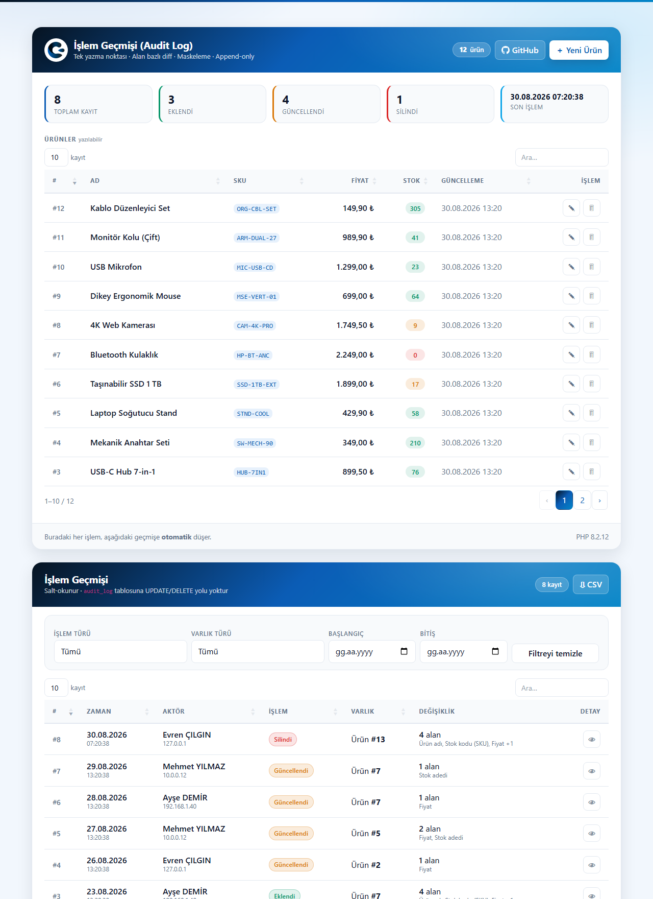
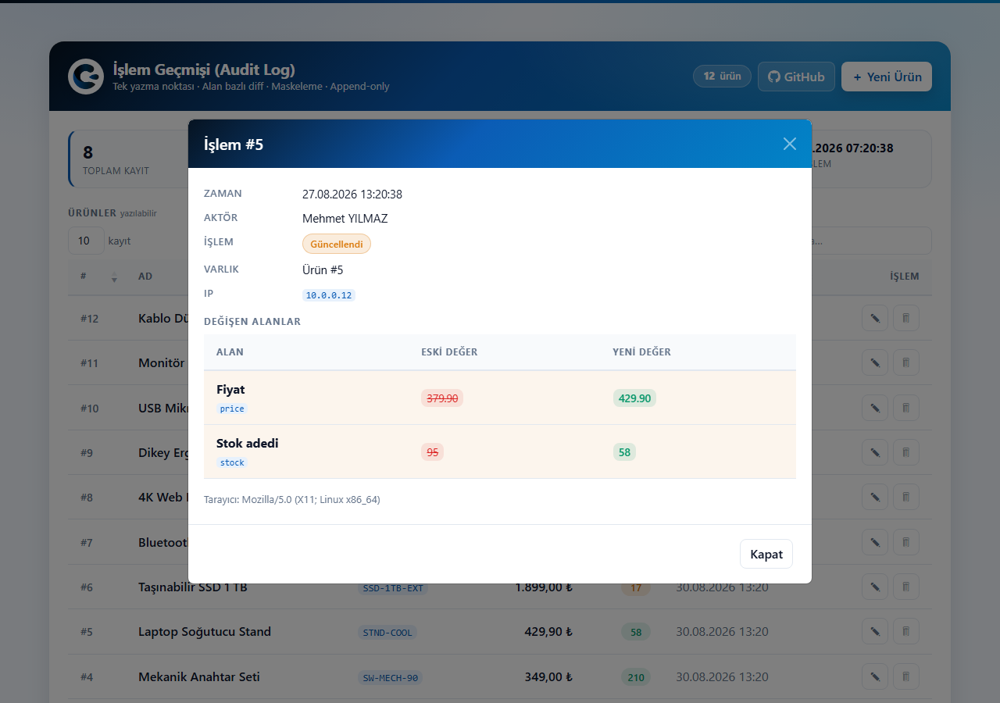
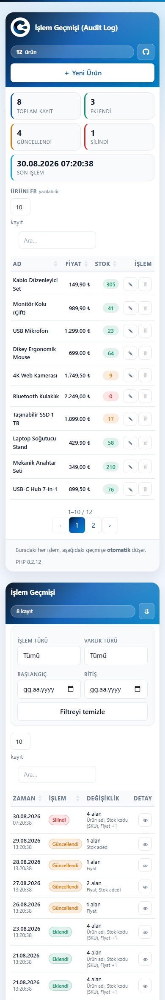

<div align="center">


# Audit Log (Change History)

### PHP PDO · MySQL · AJAX · DataTables · Bootstrap 5 · Çılgın Yazılım Design Pattern

**A record that tracks every change — and cannot be changed itself.**

[](https://php.net)
[](https://mysql.com)
[](https://getbootstrap.com)
[](https://datatables.net)
[](LICENSE)

[🇹🇷 Türkçe](README.md) · **🇬🇧 English**

[**▶ Live Demo**](https://cilginyazilim.com/kutuphane/uygulama/PHP-MySQL-Audit-Log-Islem-Gecmisi-PDO-Ajax-DataTables-main/) · [Source Library](https://cilginyazilim.com/kutuphane/php-audit-log) · [cilginyazilim.com](https://cilginyazilim.com)

</div>

---

<div align="center">

## Live Demo

**No setup, no signup, no download — try it in your browser in 3 seconds.**

<a href="https://cilginyazilim.com/kutuphane/uygulama/PHP-MySQL-Audit-Log-Islem-Gecmisi-PDO-Ajax-DataTables-main/"></a>
<a href="https://github.com/CilginYazilim/PHP-MySQL-Audit-Log-Islem-Gecmisi-PDO-Ajax-DataTables/archive/refs/heads/main.zip"></a>

<br><br>

<a href="https://cilginyazilim.com/kutuphane/uygulama/PHP-MySQL-Audit-Log-Islem-Gecmisi-PDO-Ajax-DataTables-main/" title="Click to open the live demo">
  
</a>

<sub>▲ Click the image to open the demo</sub>

</div>

<br>

### What can you try in 60 seconds?

| # | Try this | What happens behind the scenes |
|:-:|----------|--------------------------------|
| **1** | Change a product's **price** and save | An `Updated` row appears in the history instantly; the toast says **"1 field"** — that number comes from the server's `diff_values()`, it is not a guess |
| **2** | Save the same product again **without changing anything** | **No row is written.** "I pressed save" is not an event; an audit log records real changes only |
| **3** | Press the 👁 **eye** button | Field-level diff opens: old value struck through in red, new value in green. Unchanged fields are **not listed at all** |
| **4** | Look at the **address bar** while the detail modal is open | It reads `#islem-42`. Copy the link and the recipient opens **that exact record** |
| **5** | **Delete** a product | The product is gone, **its trace remains**: the `delete` row's `old_values` holds the complete final state |
| **6** | Try typing `<script>alert(1)</script>` as a product name | Rejected by validation; even if stored it would be escaped in both the list and the diff cells |
| **7** | Set the **action filter** to `Deleted` | The filter is applied server-side and works **together with** DataTables' own search box |
| **8** | Pick a **date range** | The end day is **fully inclusive** (`< next day`) — no "last day's records disappeared" bug |
| **9** | Press the ⇩ **CSV** button | The file uses **exactly the same filters** as the screen. One row per changed field, filterable in Excel |
| **10** | Open it on your phone | The table never forces horizontal scrolling; secondary columns are hidden and the data stays in the detail modal |

> **Tip:** Open **F12 → Network** while using the demo. You can watch the `action` and `csrf_token` fields sent to `ajax.php`, the JSON returned, and the HTTP status codes (200 / 403 / 422 / 429).

### About the demo environment

| Topic | Status |
|-------|--------|
| **Data** | **12 products + 8 sample audit records** from `cy_audit.sql`. No real personal data. |
| **Reset** | The demo database is **restored periodically**; your changes are not permanent. |
| **Authentication** | **None.** A deliberate choice — the example focuses on the audit layer. The actor name is written to the session as a stub. |
| **`APP_DEBUG`** | Automatically **`false`** in production — derived from the host name, `true` on localhost. |
| **Dependencies** | **Zero.** No Composer, no npm, no CDN. The demo runs identically on an offline server. |

---

## What Is This Project?

"Change history" is the single most requested feature in ERP, accounting and admin panels. Most examples you'll find online do this: create a `logs` table, write a sentence like `"Ahmet updated the product"` into it, and stop there.

That sentence leaves three questions unanswered: **which field** changed, **what was it**, and **what is it now?** Worse, nothing stops anyone from running `DELETE` on that table — so the answer to "who changed this price?" can be erased by the very person who doesn't want it answered. Such a record isn't an audit trail; it's **decoration**.

This project shows how to build an audit layer that answers all three questions: the `audit_log` table is **append-only** (the application has **no code path** that runs `UPDATE`/`DELETE` on it), records hold a **field-level diff**, sensitive fields are masked **before** they are written, and data and audit row are written **inside the same transaction** — if either fails, both are rolled back.

**Who is it for?**

- Developers adding an audit / change-history layer to their own project
- Anyone who has to answer "who changed this record?" in production
- People who want to learn PHP + AJAX + DataTables **the right way**
- Anyone looking for a reusable Bootstrap 5 design pattern

> **Clone it, import `cy_audit.sql`, run it.** No other setup step. No Composer, no npm, not even an internet connection — every library is bundled.

This project is one of the annotated, production-ready examples published under the **[Çılgın Yazılım Library](https://cilginyazilim.com/kutuphane)**.

---

## Table of Contents

- [Live Demo](#live-demo)
- [Screenshots](#screenshots)
- [Three Critical Decisions](#three-critical-decisions)
- [Features](#features)
- [Security: What Did We Close, and How?](#security-what-did-we-close-and-how)
- [Installation](#installation)
- [Configuration](#configuration)
- [Adding It to Your Own Project](#adding-it-to-your-own-project)
- [File Structure](#file-structure)
- [How It Works](#how-it-works)
- [AJAX API Reference](#ajax-api-reference)
- [Database Schema](#database-schema)
- [FAQ](#faq)
- [Going to Production](#going-to-production)
- [Troubleshooting](#troubleshooting)
- [Roadmap](#roadmap)
- [Contributing](#contributing)
- [License](#license)

---

## Screenshots

### Overview

A writable product table on top, a read-only audit log below. The stat strip between them shows the pulse of the log: total records, create / update / delete counts, and the time of the last operation.


### Field-level diff

Only **changed** fields are listed. The old value is struck through in red, the new value highlighted in green. Each field shows both its human label and its raw column name (`price`) — because the raw name is what gets written to the database.



### Mobile view

On narrow screens the table never forces horizontal scrolling: secondary columns are hidden and the information is preserved in the detail modal. Touch targets are at least 32–44px.



**Three modals:**

| Modal | Opened by | Contents |
|-------|-----------|----------|
| ✎ **Add / Edit** | New Product or the pencil button | Form, field-level error messages, "this will be recorded" notice |
| 🗑 **Delete confirmation** | Trash button | What will be deleted + **"this is recorded in the audit log"** warning |
| 👁 **Operation detail** | Eye button in the history table | Metadata (time, actor, IP, browser) + field-level diff table + shareable `#islem-42` link |

---

## Three Critical Decisions

### 1) A single write point — `audit()`

If every handler wrote its own audit row, a handler added tomorrow would **forget** to write one and nobody would notice. So there is exactly one function:

```php
audit($db, 'update', 'product', $id, $old, $new);
//     ^     ^         ^          ^     ^     ^
//     |     |         |          |     |     └─ values AFTER the operation
//     |     |         |          |     └─────── values BEFORE the operation
//     |     |         |          └───────────── record id
//     |     |         └──────────────────────── logical entity type
//     |     └────────────────────────────────── create | update | delete
//     └──────────────────────────────────────── PDO connection
```

Auditing a new entity is a one-line change. Diff generation, masking and the `INSERT` all live inside this function.

### 2) Writing data and its audit row in the same transaction

If `audit()` fails for any reason (bad encoding, disk full, lock timeout), the product row would already be committed and you'd be left with a **record that has no trace**. In an audit system this is the most dangerous failure of all, because it is silent: whoever reads the table sees nothing missing.

```php
$db->beginTransaction();
try {
    $stmt->execute([...]);                                   // data
    audit($db, 'create', 'product', $newId, null, $data);    // audit row
    $db->commit();                                           // either both…
} catch (PDOException $e) {
    $db->rollBack();                                         // …or neither
    throw $e;
}
```

This is the concrete payoff of using InnoDB.

### 3) Append-only — the record itself must be protected

There is **no endpoint** in `system/ajax.php` that does anything but `INSERT` on `audit_log`. An audit row is born only as a **side effect** of a CRUD operation; it cannot be edited or deleted from the interface.

> To enforce this at the database level as well, grant the application user only `INSERT` and `SELECT` on that table → [Going to Production](#going-to-production)

---

## Features

<table>
<tr><td width="50%" valign="top">

**Interface**
- Brand gradient header and modals
- Stat strip (total / create / update / delete / last operation)
- Three modals (form / delete confirmation / detail)
- Field-level **colour-coded diff** table
- Action, entity and **date range** filters
- **CSV export** matching the on-screen filters exactly
- Shareable record links (`#islem-42`)
- Toast notifications
- **Automatic dark mode** (follows the OS setting)
- **Separately tuned for mobile** — no horizontal scrolling, touch targets ≥32px, ARIA labelled
- Zero CDN — works offline

</td><td width="50%" valign="top">

**Backend**
- Single write point: `audit()`
- **Field-level diff** (changed fields only)
- Sensitive-field **masking** (`password`, `token`, `cvv` …)
- **Append-only** audit table
- Data + audit row in the **same transaction**
- Server-side DataTables
- One AJAX endpoint, `action`-based routing
- CSRF + rate limiting (separate buckets for writes and exports)
- Field-level validation errors (HTTP 422)
- Environment variable support, host-derived `APP_DEBUG`
- **Every line is commented**

</td></tr>
</table>

---

## Security: What Did We Close, and How?

| Vulnerability | Typical bad code | In this project |
|---------------|------------------|-----------------|
| **SQL injection** | `"... WHERE id = '".$_POST['id']."'"` | All queries are prepared statements with `EMULATE_PREPARES = false`. Sort columns go through a **whitelist**; the entity filter is validated against the fixed `AUDIT_ENTITIES` list; date filters are format-checked with `DateTime::createFromFormat`. |
| **XSS (in the audit screen)** | `$('#cell').html(row.old_value)` | Old/new values **are** user data. Escaped with `e()` on the server and `esc()` on the client. The audit screen is usually opened by your most privileged users — a hole here is the most expensive kind. |
| **CSRF** | *(usually absent)* | A 32-byte session-bound token on **every** AJAX request, verified in constant time with `hash_equals()`. Missing token → **HTTP 403**. |
| **Deleting the audit trail** | `DELETE FROM logs WHERE id = ?` | There is **no write endpoint** for `audit_log`. The only way in is `audit()`. |
| **Records with no trace** | `INSERT`, then a separate `INSERT` | Data and audit row share **one transaction**. If the audit row fails, the data is rolled back too. |
| **Leaking through the audit log** | Plain passwords inside `old_values` | Fields listed in `AUDIT_REDACT` are replaced with `***` **before** they are written. |
| **Broken encoding swallowing a record** | `json_encode()` → `false` → empty column | `JSON_INVALID_UTF8_SUBSTITUTE`: the bad byte becomes `U+FFFD`, **the record survives**. |
| **CSV formula injection** | Writing cells verbatim | Cells starting with `=`, `+`, `-`, `@` are prefixed with a single quote so Excel cannot execute them. |
| **LIKE wildcards** | `LIKE '%$search%'` | `%`, `_` and `\` are escaped. |
| **Resource exhaustion** | `LIMIT $length` | Page size is capped by `PAGE_SIZE_MAX` (200) and exports by `EXPORT_MAX_ROWS` (5000); writes and exports have separate **rate limit** buckets. |
| **Information disclosure** | MySQL errors printed to screen | `APP_DEBUG` is derived from the host name; automatically `false` in production, details go to `error_log()`. |
| **Downloadable installer file** | `/cy_audit.sql` → HTTP 200 | `.htaccess` denies `.sql`, `.md`, `.json`, `.log` … (README files are a deliberate exception). |

---

## Installation

### Requirements

- PHP **8.0+** (`pdo_mysql` extension)
- MySQL **5.7+** or MariaDB **10.3+** *(for the JSON column type)*
- Apache (XAMPP / WAMP / Laragon) — or PHP's built-in server

### Steps

**1 — Download the project**

```bash
git clone https://github.com/CilginYazilim/PHP-MySQL-Audit-Log-Islem-Gecmisi-PDO-Ajax-DataTables.git
cd PHP-MySQL-Audit-Log-Islem-Gecmisi-PDO-Ajax-DataTables
```

**2 — Create the database**

`cy_audit.sql` creates the database itself; you do not need to create `cy_audit` beforehand.

```bash
mysql -u root -p < cy_audit.sql
```

With phpMyAdmin: **Import → Choose file → `cy_audit.sql` → Go**

**3 — Run it**

```bash
php -S 127.0.0.1:8000
```

**4 — Open** → `http://127.0.0.1:8000/`

You'll see a working screen with **12 products** and **8 sample audit records**.

---

## Configuration

Everything lives in [system/config.php](system/config.php), fully commented:

| Constant | Default | Description |
|----------|---------|-------------|
| `DB_HOST` | `127.0.0.1` | Database host |
| `DB_NAME` | `cy_audit` | Database name |
| `DB_USER` | `root` | Username |
| `DB_PASS` | *(empty)* | Password |
| `AUDIT_REDACT` | `password`, `token`, `cvv` … | Field names masked with `***` **before** writing |
| `AUDIT_MODE` | `diff` | `diff` → changed fields only · `full` → full row snapshot every time |
| `AUDIT_ENTITIES` | `['product' => 'Ürün']` | Auditable entity types; drives both the filter list and validation |
| `PAGE_SIZE_MAX` | `200` | DataTables page-size cap |
| `EXPORT_MAX_ROWS` | `5000` | Maximum rows read in one CSV export |
| `RATE_LIMIT_WRITE` | `[60, 60]` | Writes: 60 requests per 60 seconds |
| `RATE_LIMIT_EXPORT` | `[10, 60]` | Exports: 10 requests per 60 seconds |
| `APP_DEBUG` | *host-derived* | `true` on `localhost` / `*.test` / `*.local`, `false` everywhere else |

### `AUDIT_MODE`: `diff` or `full`?

| | `diff` | `full` |
|-|--------|--------|
| What is stored | Changed fields only | The entire row |
| Table growth | Small | Grows fast |
| "What was the record at that moment?" | Requires replaying the chain | Answered by a single row |
| Best for | Frequently updated tables | Legal retention, rollback scenarios |

This example uses `diff`. Switching to `full` is a one-line change; both paths are implemented.

### Don't hard-code your password

All `DB_*` constants can be overridden by environment variables:

```bash
export DB_HOST=localhost DB_USER=app DB_PASS='strong-password'
```

For Apache, in `.htaccess` or `httpd.conf`: `SetEnv DB_PASS "strong-password"`

---

## Adding It to Your Own Project

You need **two things**: the `audit_log` table and the `audit()` function.

**1 — Create the table** (the `CREATE TABLE audit_log` block in `cy_audit.sql`)

**2 — Copy `audit()` and its helpers** ([system/function.php](system/function.php) → section 5)

**3 — Call it after every write:**

```php
// CREATE — no old values
$db->beginTransaction();
$stmt->execute([...]);
$newId = (int) $db->lastInsertId();
audit($db, 'create', 'order', $newId, null, $data);
$db->commit();

// UPDATE — read the old row FIRST; the diff depends on it
$old = $db->prepare('SELECT ... WHERE id = ?') /* ... */ ->fetch();
$db->beginTransaction();
$stmt->execute([...]);
audit($db, 'update', 'order', $id, $old, $data);
$db->commit();

// DELETE — no new values; old is the last copy of the record
audit($db, 'delete', 'order', $id, $old, null);
```

**4 — Register the entity** ([system/config.php](system/config.php)):

```php
define('AUDIT_ENTITIES', ['product' => 'Product', 'order' => 'Order']);
```

**5 — Add field labels** ([system/function.php](system/function.php) → `FIELD_LABELS`) — optional; without them the raw column name is shown.

> **Where does the actor come from?**
> `audit()` reads `$_SESSION['user_id']` and `$_SESSION['user_name']`. Since this example has no login, `system/ajax.php` writes a stub actor at the top of the file. In your own project delete those two lines — the session will come from your auth system.

---

## File Structure

```
.
├── index.php                      # Presentation layer — never touches the database
├── cy_audit.sql                   # Schema + 12 products + 8 sample audit records
├── README.md / README.en.md       # Documentation
├── CHANGELOG.md                   # Release notes
├── LICENSE                        # MIT
├── .htaccess                      # Security headers, file access rules
│
├── docs/screenshots/              # Images used in the README
│
├── system/
│   ├── config.php                 # Settings, session, PDO connection
│   ├── function.php               # ★ audit() — single write point + diff + masking
│   ├── ajax.php                   # AJAX endpoint / action router
│   └── .htaccess
│
└── assets/
    ├── css/
    │   ├── bootstrap.min.css
    │   ├── dataTables.bootstrap5.min.css
    │   ├── cilginyazilim.css      # ★ BRAND DESIGN PATTERN
    │   └── style.css              # This page only
    ├── js/  (jquery, bootstrap, dataTables, audit.js)
    └── images/logo.png
```

**Load order matters:**

```
CSS:  bootstrap → dataTables → cilginyazilim → style
JS:   jQuery → bootstrap.bundle → dataTables → dataTables.bootstrap5 → audit
```

---

## How It Works

```
┌─────────────────────────────────────────────────────────────────────┐
│  BROWSER  (index.php + assets/js/audit.js)                          │
│                                                                      │
│  Product table ─┐                                                    │
│  Form submit ───┤                                                    │
│  Filters ───────┼──► jQuery AJAX ──► POST { action, csrf_token, … }  │
│  History table ─┘                            │                       │
│                                              │                       │
│  After a write, refreshAll():                │                       │
│    product table + history table + counters  │                       │
└──────────────────────────────────────────────┼───────────────────────┘
                                               ▼
┌─────────────────────────────────────────────────────────────────────┐
│  SERVER  (system/ajax.php)                                          │
│                                                                      │
│   1. Is it POST?                 → 405 otherwise                    │
│   2. require_csrf()              → 403 if invalid                   │
│   3. rate_limit()                → 429 if exceeded                  │
│   4. route by action                                                │
│   5. validate_product()          → 422 + errors if invalid          │
│                                                                      │
│   6. ┌── BEGIN TRANSACTION ───────────────────────────────┐         │
│      │   INSERT / UPDATE / DELETE  →  products            │         │
│      │   audit()                   →  audit_log           │         │
│      │     ├─ diff_values()  : changed fields only        │         │
│      │     ├─ redact()       : sensitive fields → '***'   │         │
│      │     └─ audit_json()   : bad bytes → U+FFFD         │         │
│      └── COMMIT   (on failure ROLLBACK: neither is kept)  ┘         │
│                                                                      │
│   7. json_response()             → single JSON exit point           │
└─────────────────────────────────────────────────────────────────────┘
```

---

## AJAX API Reference

All requests are `POST` to [system/ajax.php](system/ajax.php) and must carry a valid `csrf_token`.

| Action | Purpose |
|--------|---------|
| `product_list` | Product list (DataTables server-side) |
| `product_fetch` | Single product as raw JSON (fills the form) |
| `product_save` | Create or update; writes a `create`/`update` audit row |
| `product_delete` | Delete; writes a `delete` audit row whose `old_values` holds the full final state |
| `audit_list` | Audit list with `f_action`, `f_entity`, `f_from`, `f_to` filters |
| `audit_detail` | Field-level diff for one record |
| `audit_export` | CSV export using **exactly the same filters** as `audit_list` |
| `stats` | Counters for the stat strip |

`audit_detail` response:

```json
{
  "success": true,
  "meta": { "id": 5, "time": "27.08.2026 13:20:38", "actor": "Mehmet YILMAZ",
            "action": "update", "action_tr": "Güncellendi", "entity": "Ürün #5",
            "ip": "10.0.0.12", "user_agent": "Mozilla/5.0 …" },
  "diff": [
    { "field": "price", "label": "Fiyat",      "old": "379.90", "new": "429.90" },
    { "field": "stock", "label": "Stok adedi", "old": 95,       "new": 58 }
  ]
}
```

`field` is the raw column name (what is stored), `label` is the display label. `null` means the field **did not exist** for that operation (`old` on create, `new` on delete).

### HTTP status codes

| Code | Meaning |
|------|---------|
| `200` | Success |
| `400` | Invalid parameter |
| `403` | Invalid CSRF token / expired session |
| `404` | Record not found |
| `405` | Non-POST request |
| `409` | Uniqueness conflict (SKU already exists) |
| `422` | Validation error (`errors` object returned) |
| `429` | Rate limit exceeded (`retry_after` in seconds) |
| `500` | Server / database error |

---

## Database Schema

```sql
CREATE TABLE `audit_log` (
  `id`          BIGINT UNSIGNED NOT NULL AUTO_INCREMENT,
  `actor_id`    INT UNSIGNED NULL DEFAULT NULL,
  `actor_name`  VARCHAR(150) NOT NULL DEFAULT 'Sistem',
  `action`      ENUM('create','update','delete') NOT NULL,
  `entity_type` VARCHAR(60)  NOT NULL,
  `entity_id`   BIGINT UNSIGNED NOT NULL,
  `old_values`  JSON NULL,                   -- NULL on create
  `new_values`  JSON NULL,                   -- NULL on delete
  `ip`          VARCHAR(45)  NOT NULL DEFAULT '',
  `user_agent`  VARCHAR(255) NOT NULL DEFAULT '',
  `created_at`  TIMESTAMP NOT NULL DEFAULT CURRENT_TIMESTAMP,
  PRIMARY KEY (`id`),
  KEY `idx_audit_entity`  (`entity_type`, `entity_id`),
  KEY `idx_audit_action`  (`action`),
  KEY `idx_audit_actor`   (`actor_id`),
  KEY `idx_audit_created` (`created_at`)
) ENGINE=InnoDB DEFAULT CHARSET=utf8mb4 COLLATE=utf8mb4_unicode_ci;
```

| Decision | Why |
|----------|-----|
| **`BIGINT` id** | The audit table grows far faster than the table it audits; the `INT` ceiling arrives sooner than you think |
| **`entity_type` + `entity_id`** | One table audits every entity. A separate log table per entity turns "what did this user do today?" into `UNION` hell |
| **`JSON` columns** | The number of fields varies per entity; fixed columns would require a schema change every time a field is added |
| **`actor_id` **and** `actor_name`** | Both are stored: even if the user is deleted or renamed, **the name as of that day** stays in the record |
| **`idx_audit_created`** | The index the date-range filter relies on; without it every query is a full scan |
| **InnoDB** | Transaction support — the prerequisite for writing data and its audit row together |

---

## FAQ

<details>
<summary><b>How big does the audit table get?</b></summary>

In `diff` mode an update row typically takes 150–400 bytes. A system handling 10,000 operations a day produces roughly 1 GB a year. Two common strategies: monthly `RANGE` **partitioning** on `created_at`, or **archiving** rows older than N months to a cold table. Archive — don't delete; deleting audit rows undermines the point of keeping them.
</details>

<details>
<summary><b>Why not just write a sentence into a `logs` table?</b></summary>

`"Ahmet updated the product"` answers none of the three questions (which field, from what, to what) and cannot be searched, filtered or reported on. A field-level diff makes "which prices were raised last month?" an SQL query.
</details>

<details>
<summary><b>Can I lock down `audit_log` at the database level too?</b></summary>

Yes, and you should:

```sql
REVOKE UPDATE, DELETE ON cy_audit.audit_log FROM 'app'@'localhost';
GRANT  INSERT, SELECT ON cy_audit.audit_log TO   'app'@'localhost';
```

Then even an SQL injection hole cannot alter the audit trail.
</details>

<details>
<summary><b>Why mask sensitive fields instead of skipping them?</b></summary>

Because you'd lose information. Writing `***` says *"this field changed but we don't store its contents"*; writing nothing is indistinguishable from *"this field never changed"*. In auditing those are two very different statements.
</details>

---

## Going to Production

- [ ] Verify `APP_DEBUG` resolves to **`false`** on your host
- [ ] Use a **least-privilege** database user instead of `root`
- [ ] **Revoke `UPDATE` and `DELETE`** on `audit_log` from the application user
- [ ] Keep credentials in **environment variables**, not in code
- [ ] Use **HTTPS**; set `session.cookie_secure = 1` and `session.cookie_httponly = 1`
- [ ] **Add authentication** and delete the stub actor lines at the top of `system/ajax.php`
- [ ] On Nginx `.htaccess` does nothing — deny `.sql` / `.md` in the server config:
  ```nginx
  location ~* \.(sql|log|ini|bak)$ { deny all; }
  ```
- [ ] Plan **archiving / partitioning** for the audit table
- [ ] Back up `audit_log` **as often as** your primary data

---

## Troubleshooting

| Symptom | Fix |
|---------|-----|
| **"Cannot connect to database"** | MySQL isn't running or `DB_*` values are wrong. |
| **`CONSTRAINT ... failed` (JSON column)** | An older revision let `json_encode()` return `false` on invalid UTF-8. `audit_json()` handles this now — make sure you're on the current files. |
| **Table stuck on "Loading…"** | F12 → Network. Usually `system/ajax.php` returned a PHP error; read the response. |
| **HTTP 403** | Session expired — reload the page. `session.save_path` must be writable. |
| **CSV looks broken in Excel** | The file is UTF-8 with BOM and `;` separated. If you used "Text to Columns", pick `;` as the delimiter. |
| **`$ is not defined`** | Script order is broken. jQuery must always load first. |
| **No row appears in the history** | The update may not have changed **any** field — in that case no record is written, by design. |

---

## Roadmap

- [ ] **Rollback** from an audit record using `old_values`
- [ ] Timeline view from `full`-mode row snapshots
- [ ] Login and role-based access (history for admins only)
- [ ] Automatic archiving / partitioning script
- [ ] Webhooks when specific fields change
- [ ] Excel (XLSX) and PDF export
- [ ] PHPUnit tests for `diff_values`, `redact`, `valid_date`
- [ ] Manual dark-mode toggle

---

## Contributing

📦 **Repository:** [github.com/CilginYazilim/PHP-MySQL-Audit-Log-Islem-Gecmisi-PDO-Ajax-DataTables](https://github.com/CilginYazilim/PHP-MySQL-Audit-Log-Islem-Gecmisi-PDO-Ajax-DataTables)

| How | Where |
|-----|-------|
| 🐛 Report a bug | [Issues](https://github.com/CilginYazilim/PHP-MySQL-Audit-Log-Islem-Gecmisi-PDO-Ajax-DataTables/issues) |
| 💡 Suggest a feature | [Issues](https://github.com/CilginYazilim/PHP-MySQL-Audit-Log-Islem-Gecmisi-PDO-Ajax-DataTables/issues) |
| 🔧 Send code | [Pull Requests](https://github.com/CilginYazilim/PHP-MySQL-Audit-Log-Islem-Gecmisi-PDO-Ajax-DataTables/pulls) |
| ❓ Ask a question | [Discussions](https://github.com/CilginYazilim/PHP-MySQL-Audit-Log-Islem-Gecmisi-PDO-Ajax-DataTables/discussions) |

### Contribution guidelines

- **Comment your code.** Teaching is the point of this project; uncommented PRs get sent back.
- **Never add a write endpoint for `audit_log`.** Append-only is the thesis of this project.
- **When adding a write operation**, don't forget the `audit()` call and the transaction.
- **Make design changes in `style.css`**; `cilginyazilim.css` belongs to the brand and is **shared** with other projects.
- Open an issue before adding a third-party dependency — this project is deliberately dependency-free.

---

## License

[MIT](LICENSE) — free for commercial use.

<div align="center">

**Built with ❤ by [cilginyazilim.com](https://cilginyazilim.com)**

If you found it useful, please leave a ⭐.

</div>
